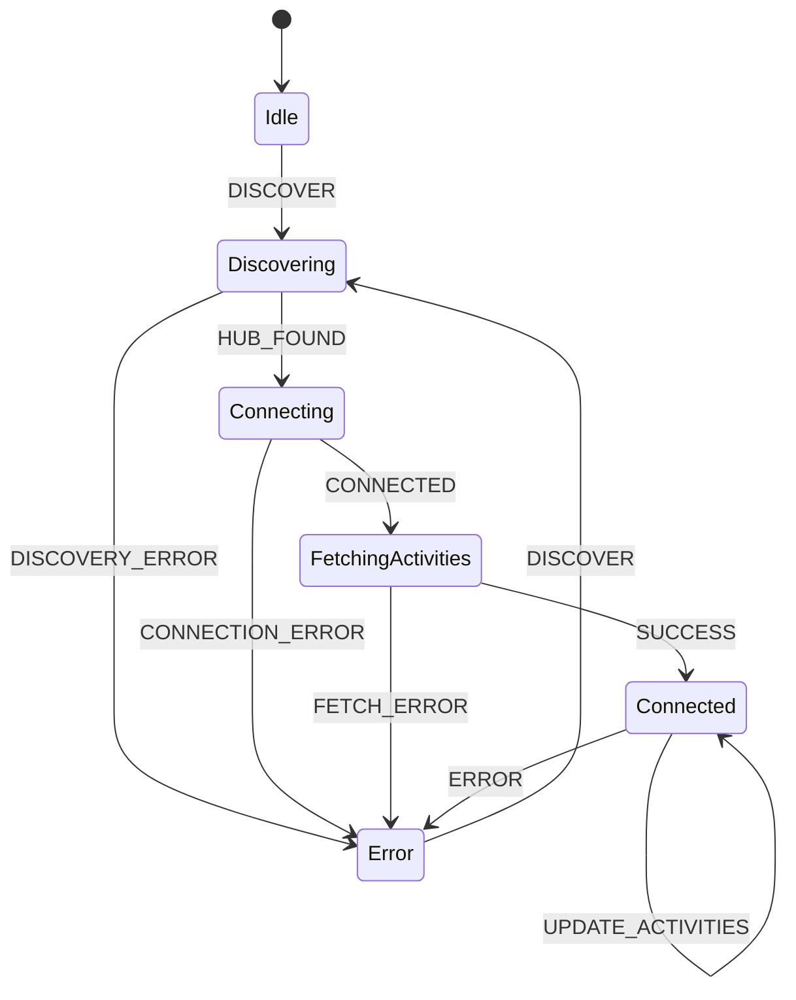

# Raycast Harmony Hub Extension Architecture

## Overview
This extension enables Raycast users to control their Logitech Harmony Hub devices directly from Raycast. It uses WebSocket communication to discover and control Harmony Hub devices on the local network.

## Core Dependencies
- `@harmonyhub/client-ws` (ISC License) - WebSocket client for Harmony Hub communication
- `@harmonyhub/discover` (ISC License) - Hub discovery on local network
- `@xstate/react` & `xstate` - State machine for robust connection management
- `@raycast/api` - Raycast extension API

## Architecture Components

### 1. State Management
The extension uses XState to manage the complex state of Harmony Hub connections:

### 2. Core Components

#### Discovery Module (`src/utils/explorer.ts`)
- Handles Harmony Hub discovery on local network
- Uses `@harmonyhub/discover` for device detection
- Manages port allocation and cleanup

#### Harmony Machine (`src/lib/harmonyMachine.ts`)
- XState machine defining connection states
- Manages transitions between states
- Handles error recovery and reconnection

#### React Components
- `ActivityList`: Displays and manages activities
- `DeviceList`: Shows available devices
- `DeviceCommandList`: Lists device commands
- `ConnectionStatus`: Shows current connection state

#### React Hooks
- `useHarmony`: Main hook for Harmony operations
- `useHarmonyMachine`: State management hook

### 3. Communication Protocol

#### WebSocket Communication
The extension uses WebSocket for bidirectional communication with the Harmony Hub:

1. **Discovery Phase**
   - UDP broadcast to find hubs
   - Hub responds with IP and identity

2. **Connection Phase**
   - WebSocket connection established
   - Authentication with hub ID

3. **Operation Phase**
   - Activities and devices fetched
   - Commands sent to hub
   - Status updates received

### 4. Error Handling

The extension implements robust error handling:
- Connection retries with backoff
- Automatic reconnection on failure
- User-friendly error messages
- Detailed logging in development

### 5. Performance Considerations

- Lazy loading of device commands
- Cached state management
- Efficient port allocation
- Memory leak prevention
- Cleanup on unmount

## Development Guidelines

1. **Code Organization**
   - Components in `src/components`
   - Hooks in `src/hooks`
   - Types in `src/types`
   - Utilities in `src/utils`

2. **State Management**
   - Use XState for complex state
   - React state for UI
   - Cached state for persistence

3. **Error Handling**
   - Always catch and log errors
   - Provide user feedback
   - Implement recovery strategies

4. **Testing**
   - Unit tests for utilities
   - Integration tests for state
   - E2E tests for commands

## Security

1. **Network Security**
   - Local network only
   - No sensitive data stored
   - Secure WebSocket connection

2. **Error Messages**
   - No sensitive info in logs
   - Sanitized user messages
   - Development-only detailed logs

## Future Improvements

1. **Features**
   - Multiple hub support
   - Custom activity creation
   - Command sequences
   - Favorites management

2. **Technical**
   - Better type safety
   - More test coverage
   - Performance optimizations
   - Better error recovery

## License and Attribution

Both `@harmonyhub/client-ws` and `@harmonyhub/discover` are used under the ISC license, which allows:
- Commercial use
- Modification
- Distribution
- Private use
