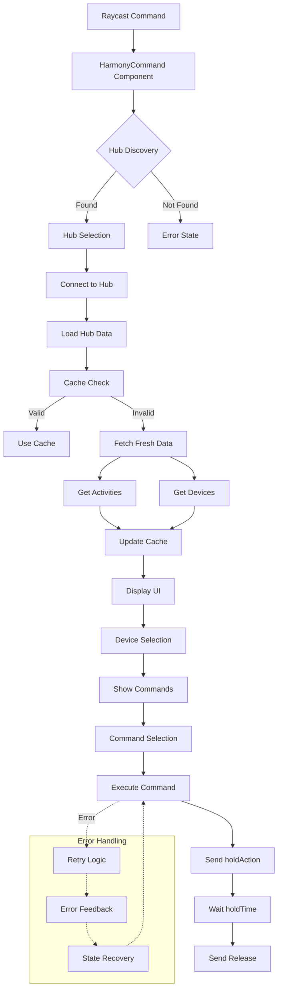

# Harmony Hub Extension Architecture

This document details the exact flow and architecture of the Harmony Hub extension, based on the working backup implementation.

## 1. Initial Command Launch Flow

When the user clicks "Control Harmony Hub" in Raycast:

1. **Entry Point** (`src/control.tsx`)
   - Renders `<HarmonyCommand />` component
   - Sets up error boundaries and global state providers

2. **Hub Discovery Process** (`src/core/harmony/harmonyManager.ts`)
   ```typescript
   discoverHubs() → Promise<HarmonyHub[]>
   ```
   
   a. **Initialization**
   - Creates Explorer instance with configured port (35000)
   - Sets up hub discovery event handlers
   - Starts 30-second discovery timeout
   
   b. **Network Discovery**
   - Uses @harmonyhub/discover to scan network
   - Listens for 'online' events from Explorer
   - For each hub found:
     ```typescript
     {
       uuid: string;       // Unique hub identifier
       ip: string;        // Hub's IP address
       friendlyName: string; // Hub's display name
       fullHubInfo: {...}  // Complete hub configuration
     }
     ```
   
   c. **Hub Processing**
   - Maps raw hub info to HarmonyHub type
   - Caches discovered hubs
   - Emits events for UI updates
   
   d. **Cleanup**
   - Stops discovery after timeout or all hubs found
   - Cleans up Explorer instance
   - Returns array of discovered hubs

## 2. Hub Selection and Data Loading

When user selects a hub:

1. **Connection Process** (`src/core/harmony/harmonyManager.ts`)
   ```typescript
   connect(hub: HarmonyHub) → Promise<void>
   ```

   a. **Client Creation**
   - Creates WebSocket client using @harmonyhub/client-ws
   - Connects to hub using IP address
   - Verifies connection with ping/pong
   
   b. **Data Loading**
   ```typescript
   loadCachedHubData() → Promise<CachedHarmonyData>
   ```
   - Checks local storage for cached data
   - If cache valid (< 24h old):
     - Returns cached activities and devices
   - If cache invalid:
     - Fetches fresh data from hub
     - Updates cache

2. **Activities Loading** (`src/core/harmony/harmonyManager.ts`)
   ```typescript
   getActivities() → Promise<HarmonyActivity[]>
   ```
   
   a. **Raw Data Fetch**
   - Sends "config" command to hub
   - Extracts activity list from response
   
   b. **Data Processing**
   ```typescript
   {
     id: string;         // Activity identifier
     name: string;       // Display name
     type: string;       // Activity type
     isCurrent: boolean; // Whether activity is active
   }
   ```

3. **Devices Loading** (`src/core/harmony/harmonyManager.ts`)
   ```typescript
   getDevices() → Promise<HarmonyDevice[]>
   ```
   
   a. **Raw Data Fetch**
   - Sends "config" command to hub
   - Extracts device list and commands
   
   b. **Data Processing**
   ```typescript
   {
     id: string;           // Device identifier
     name: string;         // Display name
     type: string;         // Device type
     commands: Command[];  // Available commands
   }
   ```

## 3. Device Command Display

When user selects a device:

1. **Command Mapping** (`src/core/harmony/harmonyManager.ts`)
   ```typescript
   mapDeviceCommands(rawDevices: any[]) → Promise<HarmonyDevice[]>
   ```
   
   a. **Command Extraction**
   - Processes device control groups
   - Extracts individual functions
   - Maps to command interface:
     ```typescript
     {
       id: string;      // Command identifier
       name: string;    // Display name
       label: string;   // User-friendly label
       deviceId: string; // Associated device
     }
     ```

2. **UI Rendering** (`src/features/control/components/DeviceList.tsx`)
   - Groups commands by device
   - Creates action panel for each command
   - Shows command metadata (name, type)

## 4. Command Execution

When user selects a command:

1. **Command Processing** (`src/core/harmony/harmonyManager.ts`)
   ```typescript
   executeCommand(deviceId: string, command: string) → Promise<void>
   ```
   
   a. **Command Preparation**
   ```typescript
   const commandBody = {
     command: string;   // Command name
     deviceId: string;  // Target device
     type: "IRCommand"  // Command type
   }
   ```
   
   b. **Execution Sequence**
   1. Send "holdAction" with command press
   2. Wait for configured hold time (default: 100ms)
   3. Send "holdAction" with command release
   
   c. **Error Handling**
   - Retries failed commands (max 2 attempts)
   - Implements exponential backoff
   - Provides detailed error feedback

## Architecture Diagram



This diagram shows the complete flow from command launch to command execution, including error handling and state management. Each component is responsible for a specific part of the process, maintaining clear separation of concerns and robust error handling throughout the execution chain.
