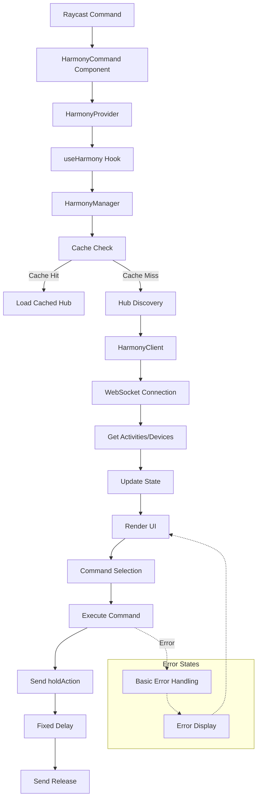

# Current Harmony Hub Extension Architecture

This document details the current implementation's architecture and flow, highlighting areas that need improvement.

## 1. Initial Command Launch Flow

When the user clicks "Control Harmony Hub" in Raycast:

1. **Entry Point** (`src/control.tsx`)
   - Renders `<HarmonyCommand />` component wrapped in `<HarmonyProvider />`
   - Sets up error boundaries

2. **State Management** (`src/hooks/useHarmony.ts`)
   ```typescript
   const HarmonyContext = createContext<HarmonyContextValue>(defaultContextValue);
   ```
   - Uses React Context for global state
   - Manages loading states and error handling
   - Provides connection and command execution methods

3. **Hub Discovery Process** (`src/services/harmony/harmonyManager.ts`)
   ```typescript
   discoverHubs() → Promise<void>
   ```
   
   a. **Cache Check**
   - Attempts to load hub from LocalStorage
   - If found, skips discovery process
   
   b. **Network Discovery**
   - Uses HarmonyClient for discovery
   - No timeout handling
   - No port management
   - Limited error handling
   
   c. **State Updates**
   - Updates through setState pattern
   - Notifies listeners via callbacks
   - Progress updates through loadingState

### Current Issues:
- No proper discovery timeout
- Missing port management
- Incomplete error handling
- Over-reliance on cache

## 2. Hub Selection and Data Loading

When user selects a hub:

1. **Connection Process** (`src/services/harmony/harmonyManager.ts`)
   ```typescript
   connectToHub(hub: HarmonyHub) → Promise<void>
   ```

   a. **Client Creation**
   - Creates new HarmonyClient instance
   - No connection validation
   - No ping/pong verification
   
   b. **Data Loading**
   ```typescript
   getActivities() → Promise<HarmonyActivity[]>
   getDevices() → Promise<HarmonyDevice[]>
   ```
   - Attempts to fetch activities and devices
   - No proper error recovery
   - No data validation

### Current Issues:
- Connection stability issues
- Missing connection verification
- Incomplete data validation
- No proper retry logic

## 3. Device Command Display

When user views devices:

1. **Command Processing** (`src/services/harmony/harmonyClient.ts`)
   ```typescript
   getDevices() → Promise<HarmonyDevice[]>
   ```
   
   a. **Data Fetching**
   - Uses raw client.send("config", {})
   - Limited error handling
   - No command validation
   
   b. **Command Mapping**
   ```typescript
   {
     id: string;
     name: string;
     type: string;
     commands: Command[];
   }
   ```

### Current Issues:
- Inconsistent command mapping
- Missing command validation
- No command grouping
- Limited error handling

## 4. Command Execution

When user selects a command:

1. **Command Processing** (`src/services/harmony/harmonyClient.ts`)
   ```typescript
   executeCommand(deviceId: string, command: string) → Promise<void>
   ```
   
   a. **Command Execution**
   ```typescript
   const commandBody = {
     command: string;
     deviceId: string;
     type: "IRCommand"
   }
   ```
   
   b. **Execution Flow**
   1. Send holdAction command
   2. Wait fixed time
   3. Send release command
   
   c. **Error Handling**
   - Basic error wrapping
   - No retry logic
   - Limited error context

### Current Issues:
- No command validation
- Missing retry logic
- Fixed hold times
- Limited error recovery

## Architecture Diagram



## Areas Needing Improvement

1. **Discovery Process**
   - Add proper timeout handling
   - Implement port management
   - Add retry logic
   - Improve error handling

2. **Connection Management**
   - Add connection validation
   - Implement ping/pong
   - Add reconnection logic
   - Improve error recovery

3. **Data Handling**
   - Add data validation
   - Implement proper caching
   - Add data refresh logic
   - Improve error context

4. **Command Execution**
   - Add command validation
   - Implement retry logic
   - Add variable hold times
   - Improve error recovery

5. **State Management**
   - Improve state transitions
   - Add state validation
   - Implement proper cleanup
   - Add state persistence

This document highlights the current implementation's architecture and its limitations. Each section identifies specific areas that need improvement to match the reliability and robustness of the backup implementation.
